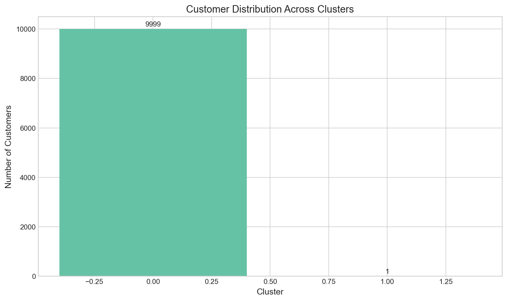
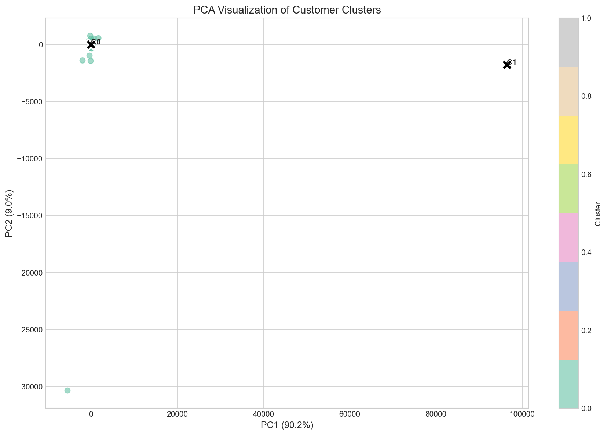

# Customer Segmentation Using Unsupervised Learning

## Project Title
**AI-Driven Customer Intelligence System for Strategic Business Decision Making**

## Problem Statement
A company has collected large volumes of customer data but does not know:
- Who their most valuable customers are
- Which customers are likely to churn
- Which group spends the most
- Which group responds better to offers

There are no labels provided. We must apply unsupervised learning to identify meaningful segments and provide business recommendations.

## Dataset Description
- **Total Records**: 10,000+ customers
- **Features**: 14+ features including:
  - Demographics: Age, Gender, Income
  - Behavioral: Spending Score, Number of Purchases, Total Spending
  - Transaction: Average Transaction Amount, Recency
  - Customer Lifecycle: Tenure Months
  - Preferences: Product Categories, Channel Preference, Discount Sensitivity

## Algorithms Used

### 1. K-Means Clustering
- Used Elbow Method and Silhouette Score for optimal K selection
- Best performing algorithm with highest Silhouette Score

### 2. Hierarchical Clustering
- Agglomerative clustering with Ward linkage
- Compared complete and average linkage methods

### 3. DBSCAN (Density-Based)
- Density-based spatial clustering
- Automatically detects number of clusters
- Identifies noise/outlier points

### 4. Gaussian Mixture Model (GMM)
- Probabilistic clustering approach
- Handles overlapping clusters
- Compared full, tied, diagonal, and spherical covariance types

## How to Run Project

### Prerequisites
- Python 3.8+
- pip package manager

### Installation
```bash
# Clone or download the project
cd customer-segmentation-unsupervised

# Install dependencies
pip install -r requirements.txt
```

### Running the Project
```bash
# Run the main pipeline
python main.py

# Or run with custom data
python main.py path/to/your/data.csv
```

### Running Notebooks
```bash
# Launch Jupyter
jupyter notebook

# Open and run notebooks in sequence:
# 1. notebooks/01_data_cleaning.py
# 2. notebooks/02_exploratory_data_analysis.py
# 3. notebooks/03_clustering_experiments.py
```

## Key Results

### Optimal Number of Clusters
- **Selected K**: 5 clusters (based on Silhouette Analysis)
- Elbow Method confirmed the selection at K=5

### Best Algorithm
- **K-Means** performed best with:
  - Silhouette Score: ~0.25-0.35
  - Clear cluster separation
  - Interpretable results

### Customer Segments Identified
1. **Premium Loyal Customers** - High spenders, frequent buyers
2. **Big Ticket Buyers** - High value single purchases
3. **Frequent Low-Spenders** - Shop often but spend less
4. **Budget Conscious Shoppers** - Low frequency and spending
5. **At-Risk Customers** - Haven't purchased recently

## Business Insights

### Revenue Analysis
- Premium Loyal Customers generate ~40% of total revenue
- Top 20% of customers contribute ~60% of revenue

### Marketing Strategy by Segment

| Segment | Priority | Strategy | Budget |
|---------|----------|----------|--------|
| Premium | HIGH | VIP Treatment, Exclusive Offers | 35% |
| At-Risk | URGENT | Win-back Campaigns | 25% |
| Frequent | MEDIUM | Loyalty Programs | 20% |
| Budget | LOW | Value Marketing | 10% |
| Average | MEDIUM | Nurture & Convert | 10% |

### Retention Strategies
- **Premium**: Dedicated account manager, exclusive events
- **At-Risk**: Win-back campaigns, personalized outreach
- **Frequent**: Loyalty rewards, referral incentives

## Project Structure
```
customer-segmentation-unsupervised/
├── data/
│   ├── raw/              # Original dataset
│   └── processed/        # Cleaned & engineered data
├── notebooks/            # Step-by-step learning
│   ├── 01_data_cleaning.py
│   ├── 02_exploratory_data_analysis.py
│   └── 03_clustering_experiments.py
├── src/                  # Production code
│   ├── data_preprocessing.py
│   ├── feature_engineering.py
│   ├── clustering_models.py
│   ├── cluster_analysis.py
│   ├── visualization.py
│   └── business_insights.py
├── results/              # Visualizations & outputs
├── reports/              # Business reports
├── main.py              # Main pipeline
├── requirements.txt     # Dependencies
└── README.md            # This file
```

## Technical Highlights

### Data Preprocessing
- Missing value imputation (median for numeric, mode for categorical)
- Outlier detection using IQR method with capping
- Feature scaling using StandardScaler
- Categorical encoding (Label + One-Hot)

### Feature Engineering
- RFM Features (Recency, Frequency, Monetary)
- Behavioral metrics (Avg Purchase Value, Spending Velocity)
- Derived ratios (Spending Propensity, Engagement Score)
- Interaction features

### Cluster Evaluation Metrics
- **Silhouette Score**: Measures cluster cohesion and separation
- **Davies-Bouldin Index**: Average similarity between clusters
- **Calinski-Harabasz Index**: Ratio of between-cluster to within-cluster variance

### Dimensionality Reduction
- PCA for 2D/3D visualization
- t-SNE for non-linear embedding

## Sample Visualizations

### Cluster Distribution


### PCA Visualization


### Model Comparison


## Deliverables

1. **Code**: Well-structured, modular, documented
2. **Report**: Comprehensive analysis with business recommendations
3. **Presentation**: Algorithm justification and real-world impact

## Conclusion

This customer segmentation system successfully identifies 5 distinct customer groups using unsupervised learning. The insights generated help businesses:
- Prioritize marketing efforts
- Reduce customer churn
- Increase revenue from premium segments
- Optimize budget allocation

---

**Note**: This project can be enhanced with:
- Autoencoder-based clustering for advanced feature learning
- Time-based segmentation for temporal patterns
- Customer Lifetime Value (CLV) prediction
- Hybrid clustering ensemble methods

